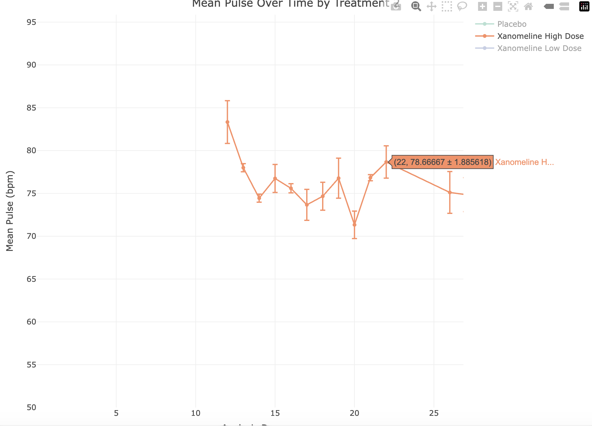

::: {.callout-note}
This is a specific example, but it illustrates a general point on the problem of rushing into using AI coding tools without fully understanding the potential pitfalls.  
All the genAI coding in the post has been generated using Claude Opus 4.6.
:::

## A Classic Example

Working in clinical development, a common task is to summarize and plot data.  As we move towards more AI-centric approaches to coding, we could consider such a task to be a good candidate for an AI coding tool.  Let's first read in some data from the {pharmaverseadam} package and ask an LLM do just this.  The example will read in `advs`, the vital signs dataset, and ask for a summary of mean pulse over time by treatment group, along with an interactive plot of the data with error bars.

```{r}
library(pharmaverseadam)
data('advs')
```

## Running with the LLM

### First Prompt

Prompt to LLM: *"Take the loaded advs data, return the mean PULSE values along with standard errors, grouped by ADY and TRTA. Give me an interactive plot of this data with error bars."*

```{r}
library(dplyr)
library(plotly)

advs |>
  filter(PARAMCD == "PULSE", ANL01FL == "Y") |>
  summarise(
    mean_val = mean(AVAL, na.rm = TRUE),
    se_val   = sd(AVAL, na.rm = TRUE) / sqrt(n()),
    .by = c(ADY, TRTA)
  ) |>
  plot_ly(
    x = ~ADY,
    y = ~mean_val,
    color = ~TRTA,
    error_y = ~list(array = se_val),
    type = "scatter",
    mode = "lines+markers"
  ) |>
  layout(
    title = "Mean Pulse Over Time by Treatment",
    xaxis = list(title = "Analysis Day"),
    yaxis = list(title = "Mean Pulse (bpm)")
  )
```

The output is not we expect.  The points are in the right place but the order in which the lines are drawn between them does not follow the order of the x-axis.  When working with plotly, the x-values must be ordered for lines to be drawn correctly.  A simple `arrange(ADY)` step will take care of this and a slighly edited prompt leads to a more satisfactory output.

### Second Prompt

*"Take the loaded advs data, return the mean PULSE values along with standard errors, grouped by ADY and TRTA. Give me an interactive plot of this data with error bars. Make sure you plot X-axis values in correct order for plotly."*

```{r}
library(dplyr)
library(plotly)

advs |>
  filter(PARAMCD == "PULSE", ANL01FL == "Y") |>
  summarise(
    mean_val = mean(AVAL, na.rm = TRUE),
    se_val   = sd(AVAL, na.rm = TRUE) / sqrt(n()),
    .by = c(ADY, TRTA)
  ) |>
  arrange(ADY) |>
  plot_ly(
    x = ~ADY,
    y = ~mean_val,
    color = ~TRTA,
    error_y = ~list(array = se_val),
    type = "scatter",
    mode = "lines+markers"
  ) |>
  layout(
    title = "Mean Pulse Over Time by Treatment 2",
    xaxis = list(title = "Analysis Day", categoryorder = "array", categoryarray = ~sort(unique(ADY))),
    yaxis = list(title = "Mean Pulse (bpm)")
  )
```

This time the plot looks far closer to what we expect, with the lines drawn in the correct order.

## What Went Wrong and Why?

The plot looks correct, filtering the data correctly, calculating the mean and standard error and plotting as expected.  It's only when we dig deep that we find the issue.  Hovering over a single datapoint we see the following:



At point ADY = 22, Xanomeline High Dose is 78.7 +/- 1.886.

The data underlying this point is:

```{r}
data <- advs |>
  filter(PARAMCD == "PULSE", ANL01FL == "Y") |>
  summarise(
    mean_val = mean(AVAL, na.rm = TRUE),
    se_val   = sd(AVAL, na.rm = TRUE) / sqrt(n()),
    .by = c(ADY, TRTA)
  ) |>
  arrange(ADY)

data |>
  filter(ADY == 22, TRTA == "Xanomeline High Dose")

```

When calculated, the mean is 78.7 and the standard error is 0.47, but the plot shows 78.7 +/- 1.886.  

This is illustrating a known issue with plotly, which is that error bars are not necessarily plotted in correct order (see https://github.com/plotly/plotly.R/issues/762).

The LLM did not know this and has interpreted the prompt exactly as was expected.

## Correcting the Issue

Telling the LLM that it the error bars are incorrect can lead to some interesting outcomes, many of which acknowledge the mistake and supply a fix, but the new code still produces the same output.  Only when we are specific can we be sure of the correct output.

*this is still incorrect. Please review https://github.com/plotly/plotly.R/issues/762 and plot again.*

Response: *The issue is that error_y arrays don't get correctly split when color creates separate traces — each trace gets the full unsplit error array. The workaround is to build traces manually per group*

```{r}
plot_data <- advs |>
  filter(PARAMCD == "PULSE", ANL01FL == "Y") |>
  summarise(
    mean_val = mean(AVAL, na.rm = TRUE),
    se_val   = sd(AVAL, na.rm = TRUE) / sqrt(n()),
    .by = c(ADY, TRTA)
  ) |>
  arrange(ADY)

p <- plot_ly()

for (trt in unique(plot_data$TRTA)) {
  d <- filter(plot_data, TRTA == trt)
  p <- p |>
    add_trace(
      data = d,
      x = ~ADY,
      y = ~mean_val,
      error_y = list(type = "data", array = d$se_val),
      type = "scatter",
      mode = "lines+markers",
      name = trt
    )
}

p <- p |>
  layout(
    title = "Mean Pulse Over Time by Treatment 4",
    xaxis = list(title = "Analysis Day"),
    yaxis = list(title = "Mean Pulse (bpm)")
  )

p
```

## The Big Picture

In many ways, AI coding tools have democratized coding, making it available to those without a coding background, and introducing new languages to those with one.  However, these tools are only as good as the data they are trained on and, if the training data are flawed, the output will be flawed.

In pharmaceutical development, many SAS programmers are transitioning to R, and coding tools are helping this transition.  There is also a push to move from static outputs to interactive ones, with plotly being a popular library and one which LLMs will favor, due to the abundance of plotly code in training data.  When used blindly, this can lead to outputs that are not fit for purpose or, as in this example, incorrect.  It is essential to build skills in any computer language and understand its idiosyncrasies in order to use it effectively with coding tools.

## Solution

This is the perfect use-case for an LLM `skill` to ensure that error bars are plotted correctly.